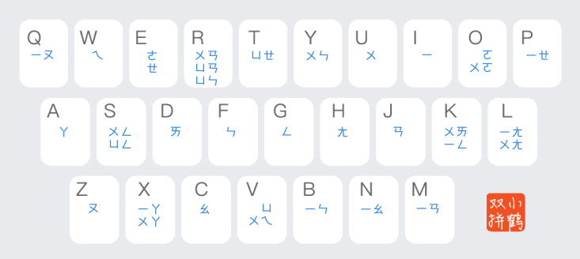

# 注音转双拼指南

## 双拼简介

双拼有很多不同的方案。本教程使用[小鹤双拼](https://flypy.cc/help/#/up)方案。

双拼的特点是：**所有汉字都可用两个字母来输入**。故称双拼。这两个字母。通常第一个是声母。第二个是韵母。当一个字音没有声母时。采用特殊方案。之后讨论。

## 为什么推荐你学

-   学习双拼对拼音熟练度要求不高。这意味着你学双拼。和拼音用户学习双拼相比。起跑线持平。反而你学习拼音时可能遇到更多困惑。拼音虽然规律性不弱。但遇到复合韵母的情况。拼法往往与注音不合。双拼给每一个韵母都指定了一个键位。使得不论拼音还是注音用户。都需要平等地去记忆这些键位。你使用拼音时。要去思考怎么拼。而使用双拼时则没有这个问题。因为你完全可以用注音去理解声母+韵母的拼读。
-   由于所有韵母都有对应的键位。你可以用注音直接标注出对应的键位。避免了 ang 没地方标的尴尬。
-   双拼既有特色。又有群体。避免了使用注音没有归属感的尴尬。
-   两个字母一个字的特性使得双拼输入起来节奏感强。击键数又较拼音、注音等短。所以输入速度稍快。
-   小鹤双拼方案普及率高。大部分简体中文输入法都支持小鹤双拼输入。支持程度略不逊于拼音。

## 零声母方案

有时。一个字音没有声母。此时依如下规律输入：

-   ㄧ和ㄨ开头的音节。将ㄧ和ㄨ与剩下的部分拆开。声母位置用 `y` 作ㄧ。用 `w` 作ㄨ。如「牙」的注音为ㄧㄚ。以 `y` 作声母ㄧ。韵母输入ㄚ对应的 `a` 键。完整双拼编码为 `ya`。
-   如该音节的拼音拼写为两个字母。则依拼音输入。如「爱」的拼音是 ɑ̀i。双拼输入 `ai`。
-   其余情况。用拼音首字母充作声母的位置。例：

    | 字  | 拼音 | 双拼编码 | 解释
    | --- | ---
    | 啊  | ɑ̄    | `aa`     | 拼音首字母 `a` 充作声母 + 韵母 a 对应的 `a` 键
    | 昂  | ɑ̄ng  | `ah`     | 拼音首字母 `a` 充作声母 + 韵母 ang 对应的 `h` 键

## 学习

把**韵母**的注音标注在对应的键位上。适应几天即可。见键位图。

在此之前。你的困难主要来于双拼基于拼音规则的部分。即：

-   哪些零声母的字拼音拼写是两个字母
-   有些声母我不会用拼音表示

下面给出辅助表格。先熟悉一下。

### 双字母拼音韵母表

| 注音 | 拼音
| ---  | ---
| ㄩ   | yu （可以试试用 `yv` 输入）
| ㄞ   | ai
| ㄟ   | ei
| ㄠ   | ao
| ㄡ   | ou
| ㄢ   | an
| ㄣ   | en

这些都较易利用英文知识认读。适当记忆即可。

### 声母键位表

以下列出不太能靠英语知识直觉认读的声母及其键位：

|     | 键位
| --- | ---
| ㄐ  | `j`
| ㄑ  | `q`
| ㄒ  | `x`
| ㄗ  | `z`
| ㄘ  | `c`
| ㄙ  | `s`
| ㄓ  | `v`
| ㄔ  | `i`
| ㄕ  | `u`

下列是较易利用英语知识推断的。过一遍即可：

|     | 键位
| --- | ---
| ㄅ  | `b`
| ㄆ  | `p`
| ㄇ  | `m`
| ㄈ  | `f`
| ㄉ  | `d`
| ㄊ  | `t`
| ㄋ  | `n`
| ㄌ  | `l`
| ㄍ  | `g`
| ㄎ  | `k`
| ㄏ  | `h`
| ㄖ  | `r`

### 韵母键位表

| 键位      | ㄧ（`i`）   | ㄨ（`u`）   | ㄩ（`v`）
| ---       | ---
| ㄚ（`a`） | ㄧㄚ（`x`） | ㄨㄚ（`x`）
| ㄛ（`o`） |             | ㄨㄛ（`o`）
| ㄜ（`e`）
| ㄝ（`e`） | ㄧㄝ（`p`） |             | ㄩㄝ（`t`）
| ㄞ（`d`） |             | ㄨㄞ（`k`）
| ㄟ（`w`） |             | ㄨㄟ（`v`）
| ㄠ（`c`） | ㄧㄠ（`n`）
| ㄡ（`z`） | ㄧㄡ（`q`）
| ㄢ（`j`） | ㄧㄢ（`m`） | ㄨㄢ（`r`） | ㄩㄢ（`r`）
| ㄣ（`f`） | ㄧㄣ（`b`） | ㄨㄣ（`y`） | ㄩㄣ（`r`）
| ㄤ（`h`） | ㄧㄤ（`l`） | ㄨㄤ（`l`）
| ㄥ（`g`） | ㄧㄥ（`k`） | ㄨㄥ（`s`） | ㄩㄥ（`s`）

## 韵母键位图

